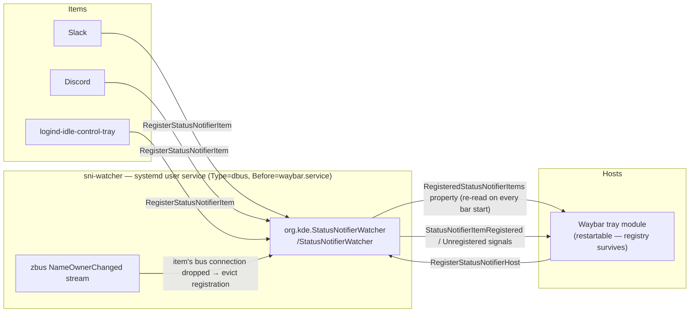

# sni-watcher

A standalone `org.kde.StatusNotifierWatcher` daemon, so the system-tray registry
survives status-bar restarts.

## The problem

The system tray uses the StatusNotifierItem (SNI) protocol, which has three roles:

- **Watcher** (`org.kde.StatusNotifierWatcher`) — the registry of all tray items
- **Host** — whatever displays them (e.g. Waybar's `tray` module)
- **Items** — the apps (Slack, blueman, …)

Waybar hosts the **watcher in-process**. That couples the registry's lifetime to the
bar's. On Hyprland, `hyprctl reload` both *freezes* Waybar and forces a restart of it
(the `hyprland/workspaces` module desyncs otherwise), and every restart rebuilds an
**empty** registry. Well-behaved apps re-register when a new watcher appears; Electron
apps (Slack, Discord, …) register exactly once and never re-register — so they vanish
from the tray until relaunched.

## The fix

Run the watcher as a separate, headless, Wayland-less process. `hyprctl reload` can't
freeze it (no surface) and a bar restart can't kill it. Waybar detects the existing
watcher at startup and attaches as a **host only**; when it restarts it just re-reads
the still-intact registry. Nothing has to re-register, so Slack stays put.

Verified: with this daemon owning the watcher, restarting Waybar — and a full
`hyprctl reload` — leaves the registered-item set completely unchanged.

All of the below is session-bus D-Bus traffic:



## Install

Packaged install only (Arch / Fedora COPR). The binary is built with `cargo
build --release`; the user unit and preset are installed from `dist/` by the
PKGBUILD / spec.

**Arch** — add the `[mason]` repo to `/etc/pacman.conf`, then install:

```ini
[mason]
SigLevel = Optional TrustAll
Server = https://masonrhodesdev.github.io/arch-repo/x86_64
```

```sh
sudo pacman -Sy sni-watcher
```

**Fedora**

```sh
sudo dnf copr enable solaris765/sni-watcher
sudo dnf install sni-watcher
```

Then enable the service:

```sh
systemctl --user enable --now sni-watcher.service
```

The package ships a systemd **user** service and a preset that enables it. The unit is
`Type=dbus` with `BusName=org.kde.StatusNotifierWatcher`, so systemd considers it
"started" only once it owns the name; its `Before=waybar.service` ordering then
guarantees the watcher is up before Waybar attaches. No Waybar config change is needed —
its `tray` module auto-detects the existing watcher and becomes a host, and the
freeze-on-reload restart workaround stays harmless to the tray.

## Build / release

Packaging follows the `cargo-rpm-macros` + vendored-deps pattern (spec and
PKGBUILD in `packaging/`, units in `dist/`). Cargo.toml is the version source
of truth; `build-srpm.sh` gates on spec Version == Cargo.toml == Cargo.lock ==
PKGBUILD pkgver.

```sh
# bump the version in Cargo.toml, packaging/sni-watcher.spec, and
# packaging/PKGBUILD (keep them in sync), then:
git tag v0.1.0 && git push --tags
packaging/build-srpm.sh           # SRPM from the tag + vendored cargo deps
packaging/build-srpm.sh --copr    # ...and submit to COPR (solaris765/sni-watcher)
packaging/build-srpm.sh --head    # build an SRPM from HEAD for local testing
```

For a quick local binary (no packaging): `cargo install --path .`.

## Verify

```sh
# watcher should be owned by sni-watcher, NOT waybar:
busctl --user list | grep StatusNotifierWatcher
# the registry survives a bar restart:
busctl --user get-property org.kde.StatusNotifierWatcher /StatusNotifierWatcher \
    org.kde.StatusNotifierWatcher RegisteredStatusNotifierItems
systemctl --user restart waybar
# ^ re-run the get-property: the item set is unchanged.
```

## Logging

Logs to stderr (captured by the journal). Control verbosity with `RUST_LOG`, e.g.
`RUST_LOG=debug`. `journalctl --user -u sni-watcher -f`.
